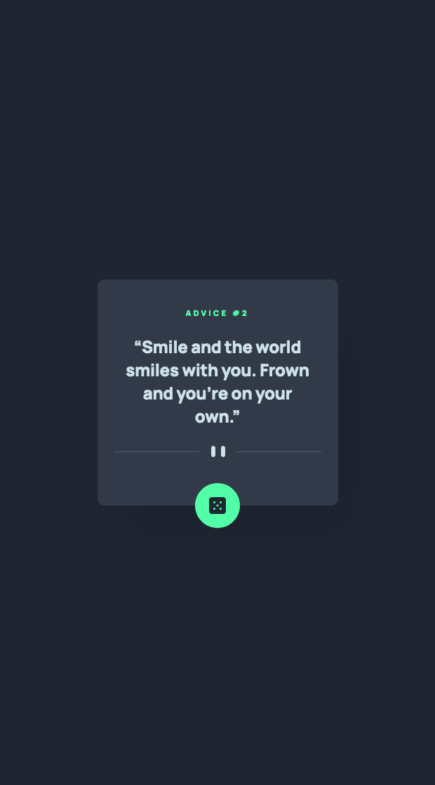

# Frontend Mentor - Advice generator app solution

This is a solution to the [Advice generator app challenge on Frontend Mentor](https://www.frontendmentor.io/challenges/advice-generator-app-QdUG-13db). Frontend Mentor challenges help you improve your coding skills by building realistic projects.

## Overview

### The challenge

Users should be able to:

- Click on the Die to receive new advice

### Screenshot

### Links

- Solution URL: [https://github.com/darpots/fm-advice-generator](https://github.com/darpots/fm-advice-generator)
- Live Site URL: [https://fm-advice-generator-six.vercel.app](https://fm-advice-generator-six.vercel.app)

## Author

- Website - [Darren Potter](https://www.darpots.dev)
- Frontend Mentor - [@darpots](https://www.frontendmentor.io/profile/darpots)
- Twitter - [@darpots](https://www.twitter.com/darpots)
